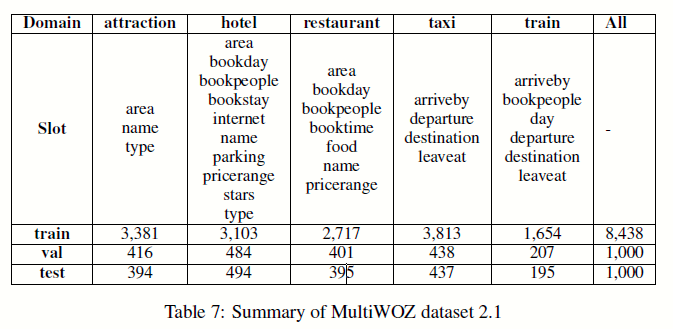

# 项目代码复写笔记

## 1. 说明

​	主要目的是为了更好的理解论文和所有细节, 特意将工程所有代码重写一遍, 以确定没有细节遗漏, 在此过程中顺便学习新知识复习老知识.

## 2. 输入说明

​	论文使用的MultiWOZ是一个公开的关于7个领域的对话数据集。最新的版本修正了对原始版本的一些标注错误(对原始低版本数据高达40%的修改). 平均来说, 一次对话涉及超过一个领域. 在实验中, 对原始数据的预处理中包含了分词, 大小写归一化, 错误词汇修正等. 训练集中包含8434次对话, 每次对话包含13.5个轮次, 平均涉及1.8个领域. 在验证集合测试集中, 每个包含1000轮次对话,  平均每次对话包含14.7个轮次,平均涉及1.8个领域.  在7个领域中, 总共有35种$(domain,slot)$ pairs. 然而, 测试集只涉及5个领域, 具体数据如下

输入内容结构解析: nadst_train_dials.json是存储了字典的列表, 一个字典是一次对话(session), 每个字典包含以下键:

| 键名         | 值类型                       |                                   |                                        |
| ------------ | ---------------------------- | --------------------------------- | -------------------------------------- |
| dialogue_idx | 字符,文件名                  |                                   |                                        |
| domains      | 列表->字符, 领域名           |                                   |                                        |
| dialogue     | 列表->字典, 一个字典是一轮次 |                                   |                                        |
|              | system_transcript            | 字符, 系统话语                    |                                        |
|              | turn_idx                     | int, 轮次id, 从0开始              |                                        |
|              | belief_state                 | 列表->字典                        |                                        |
|              |                              | slots                             | 列表, 元素为[slot,value]的字符pair构成 |
|              |                              | act                               | 字符,例如inform                        |
|              | turn_label                   | 列表,元素为[slot,value]的字符pair |                                        |
|              | transcript                   | 字符, 用户话语                    |                                        |
|              | system_acts                  | 列表->字符                        |                                        |
|              | domain                       | 字符, 本轮涉及领域                |                                        |
|              | delex_system_transcript      | 字符, 词汇处理后的系统话语        |                                        |
|              | delex_transcript             | 字符, 词汇处理后的用户话语        |                                        |

预处理部分主要工作如下

> 1. 读取ontology内容, 获取所有领域-槽(ALL_SLOTS)和领域(ALL_DOMAINS)
>    ALL_SLOTS,ALL_DOMAINS=get_slots_information(ontology)
>
>    根据字母顺序对ALL_SLOTS进行排序, 并生成相应位置ALL_SLOTS[i]的domain和slot构成的列表ordered_domains, ordered_slots, 相应关系如下
>
>    | Variable        | value         | value           | value      |
>    | --------------- | ------------- | --------------- | ---------- |
>    | ALL_SLOTS       | traffic-leave | restaurant-area | hotel-name |
>    | ordered_domains | traffic       | restaurant      | hotel      |
>    | ordered_slots   | leave         | area            | name       |
>
> 2. 构建全局词典global_vocab, 领域词典domain_vocab, 槽词典slots_vocab 和对话槽词典mem_vocab, 其中global_vocab包含所有训练数据和ontology中出现的所有单词, 特别的对于domain的名字和slot的名字将被拓展出额外的domaiName+'\_DOMAIN', slotname+'\_SLOT'到词典中; domains_vocab包含所有domainName加上'\_DOMAIN'构成的单词; slots_vocab包含所有的slotName加上'\_SLOT'构成的单词; mem_vocab=domains_vocab+slots_vocab+所有出现在train语料中的槽值单词.
>
> 3. 标签的预处理上, 首先将标签的值上的一些异常和错误处理掉(fix_label_value_error函数), 对于槽值有多个可选值的情况处理成只有一个值. 设对话状态为(traffic-leave: Shanghai,hotel-name: my Home), 相应的一些标签相关变量为
>
> | Variable           | value                   | value           | value      | Scale |
> | ------------------ | ----------------------- | --------------- | ---------- | ---------- |
> | ALL_SLOTS          | traffic-leave           | restaurant-area | hotel-name | len(ontology) |
> | gates              | gen                     | none            | gen        | len(ontology) |
> | normalized_val_len | 1                       | 0               | 2          | len(ontology) |
>
> **domains_seq**: [traffic_DOMAIN, hotel_DOMAIN, hotel_DOMAIN], scale-$1\times\sum_{domainslot \in ALL\_SLOTS}len(domainslot\_value)$
>
> **slots_seq**:[leave_SLOT, name_SLOT, name_SLOT], scale-scale-$1\times\sum_{domainslot \in ALL\_SLOTS}len(domainslot\_value)$
>
> **y_val_seq**: [Shanghai,my, Home], scale-scale-$1\times\sum_{domainslot \in ALL\_SLOTS}len(domainslot\_value)$
>
> **domainslots_index**:[0,2], scale-$1\times$ the number of domainslot involved in belief state
>
> **y_val_auto**:[Shanghai, my Home], scale-$1\times$ the number of domainslot involved in belief state
>
> 4. 对话上下文相关变量有两个,一个是dialog_history和delex_dialog_history, 设对话为$X=\{x_1^s,x_1^u,x_2^s,x_2^u,\cdots, x_t^s,x_t^u\}$, 对于第$t$轮次, $dialog\_history_t=concat(x_1^s,x_1^u,\cdots,x_t^s,x_t^u)$, $delex\_dialog\_history_t=concat(delex(x_1^s),delex(x_1^u),\cdots,delex(x_t^s),delex(x_t^u))$.