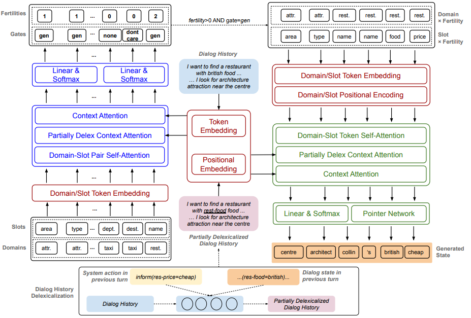

# Non-Autoregressive Dialog State Tracking阅读笔记

## 1. enviroment setting

> pytorch: 1.0.1
>
> 

## 2. model

## 2.1 概览

Our NADST has 3 key components: encoders (red), fertility decoder (blue), and state decoder (green).  (i) Encoders encode sequences of dialogue history, delexicalized dialogue history, and domain and slot tokens into continuous representations;   (ii) Fertility Decoder has 3 attention mechanisms to learn potential dependencies across <emph>(domain, slot)</emph> pairs in combination with dialogue history. The output is used to generate fertilities and slot gates;  (iii) State Decoder receives the input sequence including sub-sequences of ``(domain, slot) x fertility`` to decode a complete dialogue state sequence as concatenation of component slot values. For simplicity, we do not show feedforward, residual connection, and layer-normalization layers in the figure. Best viewed in color. 

**模型的输入**: 

- 对话历史: $X=(x_1,\cdots,x_N)$
- 领域-槽对: $X_{ds}=((d_1,s_1),\cdots,(d_G,s_H))$, $G,H$分别为领域和槽的数量. 

**模型的输出**:  通俗直观的讲, 模型的输出为槽值对, 也即$(domain-slot,value)$. 在本文中, 我们将其形式化为所有领域槽的值$Y^{d_i,s_j}$的拼接, 也即$Y=(Y^{d_1,s_1},\cdots,Y^{d_I,s_J})=(y_1^{d_1,s_1},y_2^{d_1,s_1},\cdots,y_1^{d_I,s_J},y_2^{d_I,s_J},\cdots)$, 其中$I,J$分别为输出的对话状态的领域和槽的数量.  

**模型的处理过程概览**:

- **首先,** 编码器使用字级别(token-level)的词嵌入和位置编码方法来将对话历史和槽值对的编码成连续向量. 
- 其输出**而后**输入到堆叠的自注意力机制模块和前馈神经网络用以捕捉对话历史中相关的信息, 同时对应每个领域和槽$(d_g,s_h)$生成一个丰富度(fertility)$Y_f^{d_g,s_h}$(non-autoregressive模块的输出). 该模块的输出可表示为一个序列$Y_{fert}=Y_f^{d_1,s_1},\cdots,Y_f^{d_G,s_H}$, 此处$Y_f^{d_g,s_h}\in \{0,max(SlotLength)\}$. 
- **再然后**, 使用一个门机制来做备用的预测,  每个门$g$有三种可能的值: "none","dontcare"和"generate". 这些门的输出将作为丰富度解码器(fertility decoding)的输入之一. 门输出可以表示为$Y_{gate}=Y_g^{d_1,s_1},\cdots,Y_g^{d_G,s_H}$. 
- $X_{ds\times fert}=((d_1,s_1)^{Y_f^{d_1,s_1}},\cdots,(d_G,s_H)^{Y_f^{d_G,s_H}})$, 其中$(d_1,s_1)^{Y_f^{d_1,s_1}}$表示$(d_1,s_1)$重复$Y_f^{d_1,s_1}$次的结果. 模型的设定为$||X_{ds\times fert}||=||Y||$, 也就是说, 用$X_{ds\times fert}$来协助输出的预测. 解码器将藉由在这个序列上的注意力机层进行预测.不懂但是感觉有用的话

>  The decoder projects this sequences($X_{ds \times fert}$) through attention layers with dialogue history. During this decoding process, we maintain **a memory** of hidden states of dialogue history. The output from the state decoder is used as a query to **attend on this memory and copy tokens from dialogue history to generate a dialogue state**.

- 使用前一轮的信息(a partially delexicalized dialogue history $X_{del}$)用以预测当前轮次的状态,对于一个字$x_n$和当前轮次, 那么被处理成
$$
x_{n,del}=delex(x_n)=\left\{
\begin{aligned}
&domain_{idx}-slot_{idx},&if x_n \subset \hat Y_{t-1}\\
&x_n,&otherwise
\end{aligned}
\right.\\
domain_{idx}=X_{ds\times fert}[idx][0], slot_{idx}=X_{ds\times fert}[idx][1]\\
idx=Index(x_n,\hat Y_{t-1})
$$

​				例如: "I look for a cheap hotel" is delexicalized to "I look for a hotel_pricerange hotel." if the slot hotel_pricerange is predicted as "cheap" in the previous turn. 

- 另外, 模型也使用相同方式处理了前一个轮次的系统动作作为模型的输入.

## 2.2 编码器具体细节

编码器的主要目标主要将对话历史$X$编码成一系列向量$Z=(z_1,\cdots,z_N)\in R^{N\times d}$. 同时, 部分词汇意义处理的对话历史$X_{del}$被编码成$R^{N\times d}$, 模型将对话历史$Z$传入指针网络(pointer network)用来复制字词到对话状态生成. 这将从一定程度上缓解OOV问题. 模型也将(domain,slot)编码成连续的向量$z_{ds}\in R^{d}$.(Each vector $z_{ds}$ is used to store contextual signals for slot and fertility prediction during the decoding process)

**Context Encoder**: 包含字级别可训练的词嵌入层和归一化层. 包含使用sine和cosine函数的位置编码层. 最后使用位加法组合字层级的向量. 编码器中将原始的对话历史, delexicalized对话历史的词向量共享, 后续有用于fertility decoder 和state decoder的输入. 最终$X$和$X_{del}$的词嵌入可以被定义为
$$
Z=Z_{emb}+PE(X)\in R^{N\times d}\\
Z_{del}=Z_{emb,del}+PE(X_{del})\in R^{N\times d}\notag
$$
**Domain and slot Encoder**: 每一个(domain, slot)对都会被编码为两个向量的和, 也即是对于领域槽对$(s,h)$会被领域向量$z_d$和槽向量$z_s\in R^d$使用位加法组合得到:
$$
z_{d_g,s_h}=z_{d_g}+z_{s_h}\in R^d\notag
$$
(没看懂的话,记录下)We share the embedding weights to embed domain and slot tokens in both fertility decoder and state decoder. However, for input to state decoder, we inject sequential information into the input $X_{ds\times fert}$ to factor in position-wise information to decode target state sequence. In summary, $X_{ds}$ and $X_{ds \times fert}$ is encoded as following:
$$
Z_{ds}=Z_{emb,ds}=z_{d_1,s_1}\oplus \cdots \oplus z_{d_G,s_H}\\
Z_{ds\times fert}=Z_{emb,ds\times fert}+PE(X_{ds\times fert})\\
Z_{emb,ds\times fert}=(z_{d_1,s_1})^{Y_f^{d_1,s_1}}\oplus\cdots\oplus (z_{d_G,s_H})^{Y_f^{d_G,s_H}}\notag
$$
Note that different from a typical decoder input in Transformer, we do not shift the input sequences to both fertility decoder and state decoder by one position as we consider non-autoregressive decoding process in both modules. 所以在位置$i$的字项生成是基于其余位置的字项序列, 也即是在fertility decoder中的$1,\cdots,i-1,i+1,\cdots,||X_{ds}||$和state decoder中的$1,\cdots,i-1,i+1,\cdots,||X_{ds\times fert}||$.

**Fertility Decoder**: 基于对话历史的编码结果$Z$, 词汇意义处理后的对话历史$Z_{del}$和领域槽对的编码$Z_{ds}$ 学习上下文信息, 并且通过一系列的注意力机制村春雨$z_{ds}$中. 此处使用多头注意力机制去将已有表示映射到多重子空间中. 多头注意力机制主要定义为查询$K$和值$V$的点乘结果:
$$
Attention(Q,K,V)=softmax(\frac{QK^T}{\sqrt d_k}V)\notag
$$
每一个多头注意力模块随后是一个基于位置的前馈神经网络, 此处我们使用两个ReLU激活层. Fertility decoder模块主要由三个注意力层构成, 每个都学习相关的上下文信息输入到$z_{ds}$中:
$$
\begin{aligned}
&Z_{ds}^{out}=Attention(Z_{ds},Z_{ds},Z_{ds})\in R^{N\times d}\\
&Z_{ds}^{out}=Attention(Z_{ds}^{out},Z_{del},Z_{del})\in R^{N\times d}\\
&Z_{ds}^{out}=Attention(Z_{ds}^{out},Z,Z)\in R^{N\times d}\\
\end{aligned}
$$
模型中使用第一层多头注意力机制来获取领域槽的联系, 随后的几层用来获取上下文关联. 加入词汇意义处理的对话历史可以使模型能够学习到领域槽和一般的槽值之间的联系. 为了进一步提升这些联系之间的学习, 将$Z_{ds}$重复$T_{fert}$次投入到注意力层. 在注意力步骤$t$中, 前一个注意力层$t-1$的输出被用以计算$Z_{ds}^t$. 最后一层的输出$Z_{ds}^{T_{fert}}$被传入到两个独立的线性层用以预测fertilities and gates:
$$
P^{gate}=softmax(W_{gate}Z_{ds}^{T_{fert}}), W_{gate}\in R^{d\times 3}\\
P^{fert}=softmax(W_{fert}Z_{ds}^{T_{fert}}), W_{fert}\in R^{d\times 10}\notag
$$
使用标准的交叉熵来训练这个部分的预测:
$$
L_{gate}=\sum_{d_g,s_h}-\log(P^{gate}(Y_g^{d_g,s_h}))\\
L_{fert}=\sum_{d_g,s_h}-\log(P^{fert}(Y_f^{d_g,s_h}))\notag
$$

## 2.3 State Decoder

给定需要生成门(the generated gates)和丰富度(fertilities), 将gate为“dontcare”和“none”的门筛除后的结果为$X_{ds\times fert}$. 给定输入$Z_{ds\times fert}$并将注意力序列重复$T_{state}$次后，最终的输出$Z_{ds\times fert}^{T_{state}}$被用来做状态的预测：
$$
P_{vocab}^{state}=softmax(W_{state}Z^{T_{state}}_{ds\times fert}), W_{state} \in R^{d\times ||V||}\notag
$$
其中，$||V||$是输出字典。考虑开放词典的DST模型不预设输出词典，模型本省使用指针网络来做状态预测：
$$
P_{ptr}^{state}=softmax(Z_{ds\times fert}^{T_{state}}Z^T)\notag
$$
最终状态的预测为两个概率的加权：
$$
P^{state}=p_{gen}^{state}\times P_{vocab}^{state}+(1-p_{gen}^{state})\times P_{ptr}^{state}\\
p_{gen}^{state}=sigmoid(W_{gen}V_{gen})\\
V_{gen}=Z_{ds\times fert}\oplus Z_{ds\times fert}^{T_{state}}\oplus Z_{exp}\notag
$$
其中$W_{gen}\in R^{3d \times 1}$，$Z_{exp}$是$Z,Z_{ds\times fert}$在相同维度的凭借结果。最后，输出的概率将被作为训练状态追踪模块的损失函数的输入
$$
L_{state}=\sum_{d_g,s_h}\sum_{m=0}^{Y_f^{d_g,s_h}}-\log(P^{state}(y_m^{d_g,s_h}))\notag
$$

## 2.4 优化

整体网络架构的参数以一个损失函数为优化目标：
$$
L=L_{state}+\alpha L_{gate}+\beta L_{fert}\notag
$$
其中$\alpha,\beta$是超参数。

## 3. 实验

## 3.1 Datasets

They use the MultiWOZ benchmark, including both version 2.0 ([Link](https://drive.google.com/drive/folders/1_DxHCT78LcLw08sss-F_vIwkgH6q1HmK?usp=sharing)) and 2.1 ([Link](https://drive.google.com/drive/folders/1qOZIBauQiqbMC7VB-KTVSkH_F-KAE6wm?usp=sharing)). Download the data and unzip into the root directory of the repo e.g. `NADST/data2.0` and `NADST/data2.1`.

MultiWOZ是一个公开的关于7个领域的对话数据集。最新的版本修正了对原始版本的一些标注错误(对原始低版本数据高达40%的修改). 平均来说, 一次对话涉及超过一个领域. 在实验中, 对原始数据的预处理中包含了分词, 大小写归一化, 错误词汇修正等. 训练集中包含8434次对话, 每次对话包含13.5个轮次, 平均涉及1.8个领域. 在验证集合测试集中, 每个包含1000轮次对话,  平均每次对话包含14.7个轮次,平均涉及1.8个领域.  在7个领域中, 总共有35种$(domain,slot)$ pairs. 然而, 测试集只涉及5个领域, 具体数据如下

## 3.2 训练过程

工程中使用了标签平滑化[1](#smooth)用来训练对话状态$Y$的预测模块, 但这个东西并没有用到fertilities $Y_{fert}$和gates $Y_{gate}$的预测模块中. (不懂的话)During training, we adopt 100% teacher-forcing learning strategy by using the ground-truth of $X_{ds\times fert}$ as input to the state decoder. (似乎是使用了一部分实际的标签来做,而非模型内部的模块输出). 使用了Adam optimizer, 使用了网格搜索来确定超参数值.

## 4. 工程详解

## References

- [1. ][ Label Smoothing] Christian Szegedy, Vincent Vanhoucke, Sergey Ioffe, Jon Shlens, and Zbigniew Wojna. Rethinking the inception architecture for computer vision. In Proceedings of the IEEE conference on computer vision and pattern recognition, pp. 2818–2826, 2016.
